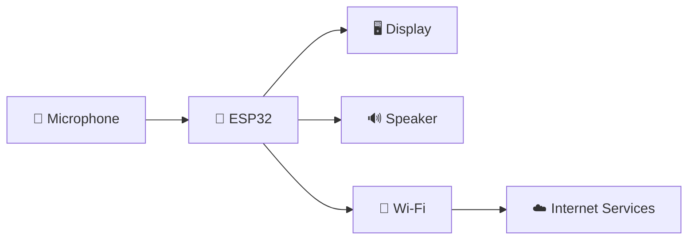
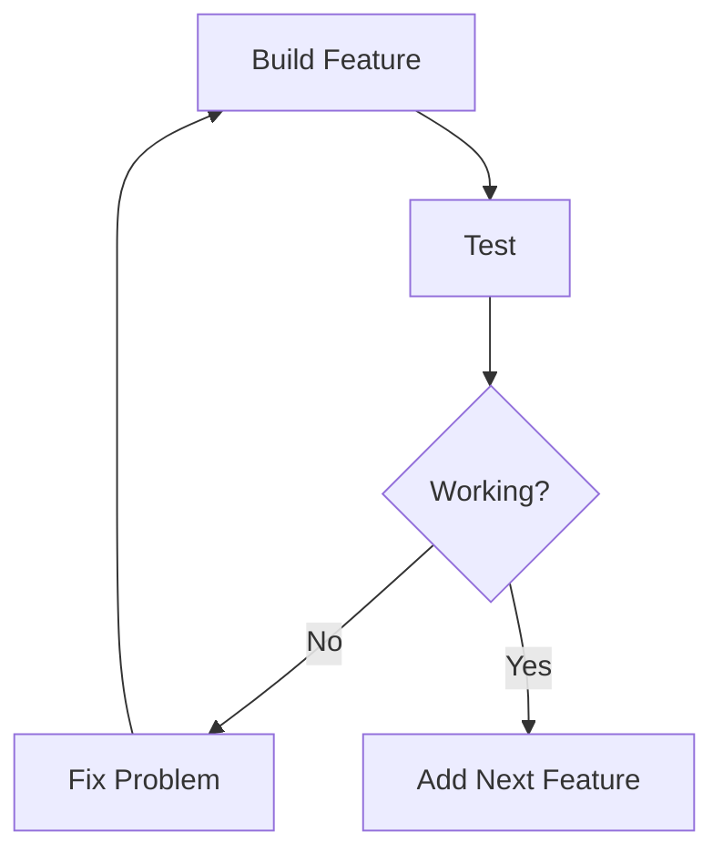
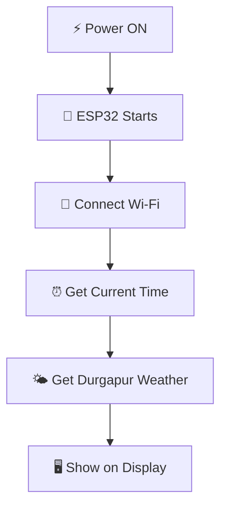
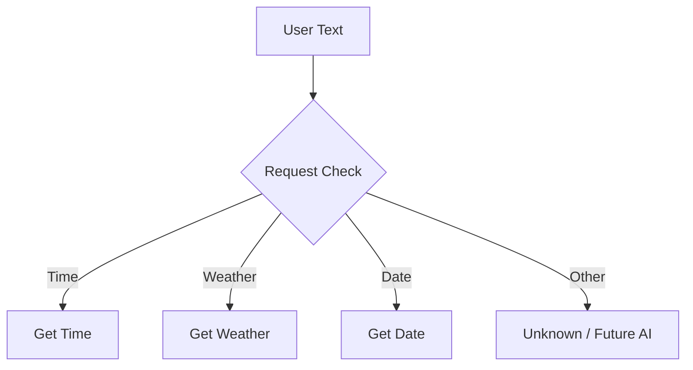
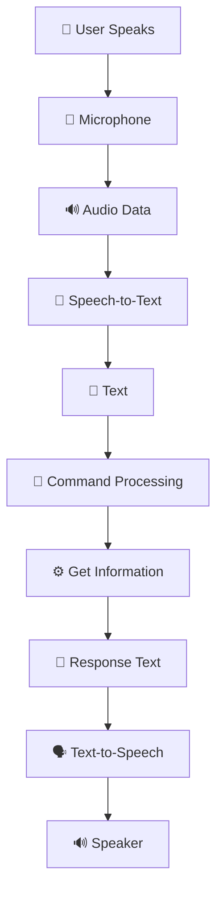
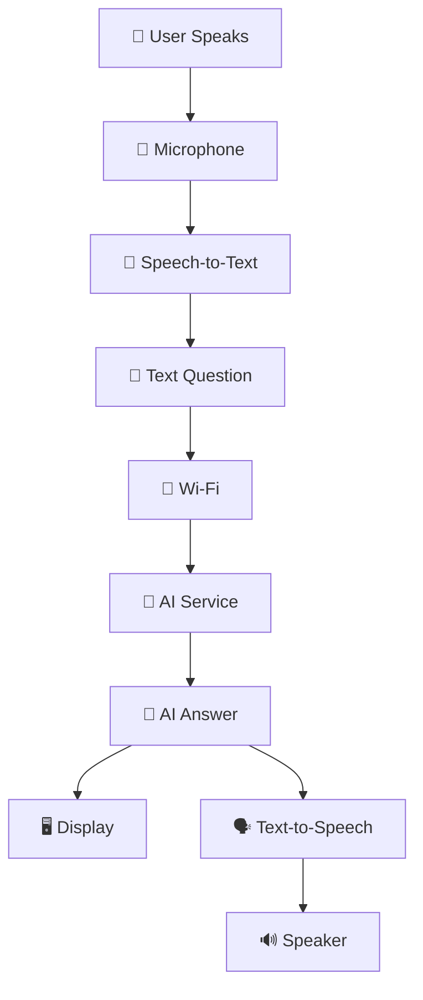
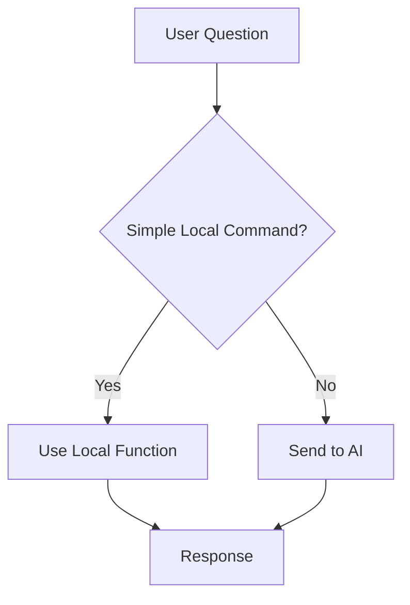
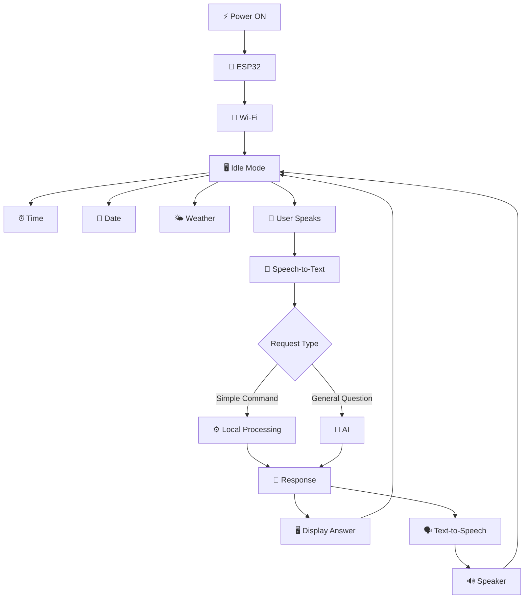

# 🤖 Desk Buddy — Friends Ko Explain Karne Ka Guide

> **Purpose:** Is document ko padhkar main apne friends ko project easily explain kar sakta hoon.
>
> **Language:** Hinglish (Hindi in English letters)

---

# 1. Project Actually Hai Kya?

Agar koi pooche:

> **"Bhai tera project kya hai?"**

Main bolunga:

**Desk Buddy ek chhota smart device hoga jo desk par rahega. Idle time mein ye time, date aur Durgapur ka current weather dikhayega. Jab main isse interact karunga, ye meri voice sunega, question ko process karega, aur answer screen aur speaker dono se dega.**

Basically:

> **Ek mini smart assistant jo physically desk par rahega.**

---

# 2. One-Line Explanation

> **"Desk Buddy ek ESP32-based smart desk assistant hai jo time, date aur weather dikhayega aur future mein voice ke through questions ka answer bhi karega."**

---

# 3. Iska Brain Kya Hai?

Is project ka main controller hoga:

# 🧠 ESP32

Isko simple mein project ka **brain/controller** samjho.

ESP32 control karega:

- 📶 Wi-Fi
- 🖥️ Display
- 🎤 Microphone
- 🔊 Speaker
- 🌤️ Weather requests
- 🤖 AI communication



---

# 4. Wi-Fi Kaise Kaam Karega?

ESP32 mein generally **built-in Wi-Fi** hota hai.

Isliye normally:

> **Alag Wi-Fi dongle ki zarurat nahi hoti.**

```text
ESP32
   ↓
Home Wi-Fi
   ↓
Internet
```

Internet ka use hoga:

- Current weather ke liye
- Speech-to-Text ke liye
- AI ke liye
- Text-to-Speech ke liye

---

# 5. Kya PC Hamesha ON Rakhna Padega?

# ❌ Nahi

Hum code pehle PC/laptop par likhenge.

```text
💻 PC/Laptop
      ↓
Write C++ Code
      ↓
Compile
      ↓
Upload to ESP32
      ↓
🧠 ESP32 Memory
```

Uske baad:

```text
⚡ Power ON
      ↓
ESP32 Starts
      ↓
Program Runs
      ↓
🤖 Desk Buddy Works
```

PC ko baad mein ON rakhne ki zarurat nahi hogi.

---

# 6. Project Ko Phases Mein Kyun Divide Kiya?

Project mein bahut saare parts hain:

- Display
- Wi-Fi
- Weather API
- Microphone
- Speech-to-Text
- Speaker
- Text-to-Speech
- AI

Sab kuch ek saath banayenge toh debugging difficult hogi.

Isliye rule hai:

> **Build → Test → Confirm → Next Feature**



---

# 🟢 PHASE 01 — Smart Display

## Goal

Pehle sirf ek smart information display banana hai.

Ye dikhayega:

- ⏰ Current Time
- 📅 Current Date
- 🌤️ Current Weather
- 🌡️ Temperature
- 📍 Durgapur

Example:

```text
DESK BUDDY

11:42 AM

Friday
04 September

📍 Durgapur
🌤️ 30°C Cloudy
```

## Complete Flow



### Friends Ko Kaise Explain Karna Hai?

> **"Jab device ON hoga, ESP32 Wi-Fi se connect karega. Internet se current time aur Durgapur ka weather fetch karega aur display par show karega."**

---

# 7. Time Kahan Se Aayega?

ESP32 internet ke through time service se correct time synchronize karega.

```text
ESP32
   ↓
Internet
   ↓
⏰ Time Service
   ↓
Correct Time
   ↓
Display
```

---

# 8. Weather Kahan Se Aayega?

Weather ke liye ek **Weather API** use hoga.

Simple explanation:

> **API ek method hai jiske through hamara program kisi online service se information mangta hai.**

Example:

```text
ESP32:
"Give me weather of Durgapur"
        ↓
☁️ Weather API
        ↓
30°C, Cloudy
        ↓
🖥️ Display
```

---

# 🟡 PHASE 02 — Voice Assistant

## Goal

Ab hum add karenge:

- 🎤 Microphone
- 🔊 Speaker
- 📝 Speech-to-Text
- 🗣️ Text-to-Speech

Example:

> 👤 User: "What time is it?"

> 🤖 Desk Buddy: "The current time is 11:42 AM."

---

# 9. Voice System Kaise Kaam Karega?

## Step 1 — User Bolta Hai

```text
"What is the weather?"
```

## Step 2 — Microphone Voice Capture Karta Hai

```text
👤 Voice
   ↓
🎤 Microphone
   ↓
🔊 Audio Data
```

Important:

> **Microphone words ko directly nahi samajhta. Wo sirf sound capture karta hai.**

---

# 10. Speech-to-Text Kya Hai?

Speech-to-Text ya STT ka matlab:

> **Human voice ko written text mein convert karna.**

```text
🎤 Voice
"What is the weather?"
        ↓
📝 Speech-to-Text
        ↓
"What is the weather?"
```

---

# 11. Text Milne Ke Baad Kya Hoga?

System check karega ki user kya pooch raha hai.

```text
"What time is it?"
        ↓
TIME COMMAND
        ↓
Get Current Time
```

```text
"What is the weather?"
        ↓
WEATHER COMMAND
        ↓
Get Weather
```

---

# 12. Command Processor Kya Hai?

Simple words mein:

> **"Ye system ka wo part hai jo user ke text ko analyze karke decide karta hai ki kaunsa function chalana hai."**



---

# 13. Text-to-Speech Kya Hai?

Text-to-Speech ya TTS ka matlab:

> **Written text ko spoken voice mein convert karna.**

Example:

```text
"The current time is 11:42 AM."
        ↓
🗣️ Text-to-Speech
        ↓
🔊 Audio
        ↓
Speaker
```

---

# 14. Speaker Kaise Kaam Karega?

Audio output ka basic flow:

```text
🧠 ESP32
      ↓
🔊 Audio Signal
      ↓
Audio Amplifier
      ↓
🔊 Speaker
```

Speaker user ko final answer sunayega.

---

# Phase 02 Complete Flow



---

# 🔴 PHASE 03 — AI Assistant

## Goal

Ab Desk Buddy sirf fixed commands tak limited nahi rahega.

Examples:

- "What is a black hole?"
- "Explain recursion."
- "What is artificial intelligence?"

---

# 15. AI Kaise Kaam Karega?



---

# 16. Kya ESP32 Ke Andar ChatGPT Jaisa AI Chalega?

# ❌ Directly nahi

ESP32 large AI models run karne ke liye powerful enough nahi hai.

Isliye:

```text
🧠 ESP32
      ↓ Sends Question
☁️ Internet
      ↓
🤖 AI Server
      ↓ Processes Question
💬 Answer
      ↓
🧠 ESP32
```

Simple line:

> **"ESP32 question AI service ko bhejega aur answer receive karega."**

---

# 17. Local Command vs AI Question

Har request ke liye AI use karna zaruri nahi hai.



### Local

- What time is it?
- What is today's date?
- What is the weather?

### AI

- Explain black holes.
- What is recursion?
- Tell me about AI.

---

# 18. Idle Mode Kya Hota Hai?

Idle mode matlab:

> **Jab user device se interact nahi kar raha hota.**

Screen par normal information dikhegi:

```text
⏰ 11:42 AM

📅 Friday
04 September

🌤️ Durgapur
30°C Cloudy
```

Interaction ke time:

```text
🎤 Listening...
```

Processing ke time:

```text
🤔 Processing...
```

Answer ke baad:

```text
Return to Idle Screen
```

---

# 19. Complete Project Ka Final Flow



---

# 20. 2-Minute Explanation Script

Agar mujhe friends ko jaldi explain karna ho toh main bolunga:

> **"Bhai, mera project ek Desk Buddy hai. Basically ek chhota smart assistant jo desk par rahega. Iska main controller ESP32 hoga aur iske saath display, microphone aur speaker connected honge."**

> **"Project ko main teen phases mein bana raha hoon. Pehle phase mein ye Wi-Fi connect karke current time, date aur Durgapur ka weather display karega."**

> **"Second phase mein microphone aur speaker add honge. Jab main kuch bolunga, microphone voice capture karega. Speech-to-Text voice ko text mein convert karega. System command ko samjhega aur response generate karega."**

> **"Us response ko Text-to-Speech ke through voice mein convert kiya jayega aur speaker answer bolega."**

> **"Third phase mein AI integrate karunga. Simple command hai toh system locally handle karega. General question hai toh question AI service ko bheja jayega. Answer wapas aayega, screen par show hoga aur speaker se bhi bola jayega."**

> **"Main project ko phase by phase bana raha hoon taaki har component properly test ho aur debugging easy rahe."**

---

# 21. Important Terms

## 🧠 ESP32

> Project ka main controller/brain.

## 🎤 Microphone

> User ki voice capture karta hai.

## 📝 Speech-to-Text

> Voice ko text mein convert karta hai.

## 🧠 Command Processing

> Text ko samajhkar correct function choose karta hai.

## 🤖 AI

> General questions ka intelligent answer generate karta hai.

## 🗣️ Text-to-Speech

> Written text ko spoken voice mein convert karta hai.

## 🔊 Speaker

> Final answer user ko sunata hai.

## ☁️ API

> Program ko online service se communicate karne deta hai.

---

# 🏁 Final Summary

## Phase 01

```text
Time + Date + Weather
```

## Phase 02

```text
Voice → Text → Command → Answer → Voice
```

## Phase 03

```text
Voice → Text → AI → Answer → Voice
```

---

# 💡 Golden Line

> **"ESP32 project ka controller hai. Microphone voice input leta hai, Speech-to-Text voice ko text mein convert karta hai, system request process karta hai, AI general questions handle karta hai, Text-to-Speech answer ko audio mein convert karta hai aur speaker final response sunata hai."**

---

> # Build → Test → Confirm → Improve 🤖
