# 🚀 Desk Buddy — Development Phases

> A detailed step-by-step development roadmap for building the Desk Buddy smart assistant.


---

# 📖 Table of Contents

- [Project Overview](#-project-overview)
- [Development Strategy](#-development-strategy)
- [Phase 01 — Smart Display](#-phase-01--smart-display)
- [Phase 02 — Voice Assistant](#-phase-02--voice-assistant)
- [Phase 03 — AI Assistant](#-phase-03--ai-assistant)
- [Testing Strategy](#-testing-strategy)
- [Final Architecture](#-final-architecture)

---

# 🤖 Project Overview

Desk Buddy is being developed in stages.

The final device will:

- Show time and date
- Show weather for Durgapur
- Connect to Wi-Fi
- Receive voice input
- Convert speech into text
- Process commands
- Answer questions using AI
- Display responses
- Speak responses through a speaker

Instead of building everything at once, each feature will be developed and tested separately.

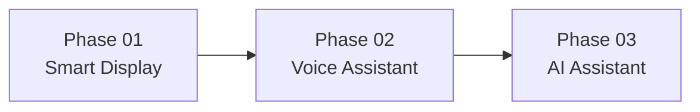

---

# 🧠 Development Strategy

The most important rule of this project is:

> **Build one feature → Test it → Confirm it works → Add the next feature.**

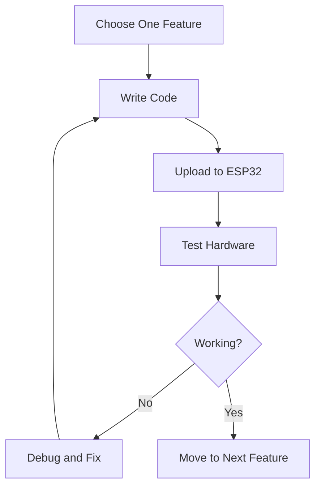

This approach prevents the project from becoming difficult to debug.

---

# 🟢 Phase 01 — Smart Display

## 🎯 Main Goal

Build a working Desk Buddy that can independently display:

- ⏰ Current time
- 📅 Current date
- 📍 Location
- 🌤️ Current weather
- 🌡️ Temperature

For this project, the initial location will be:

> **Durgapur, West Bengal**

---

## Phase 01 System Flow

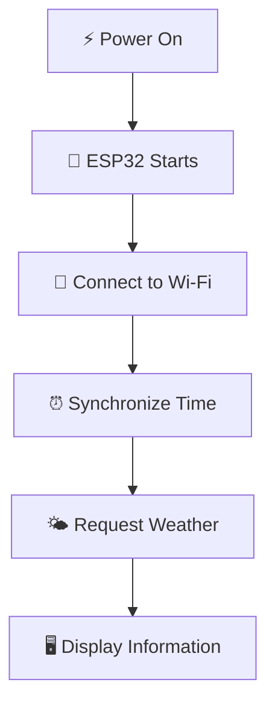

---

## Step 01 — Select the Main Controller

The first task is selecting the correct ESP32 board.

The board should provide:

- Built-in Wi-Fi
- Enough GPIO pins
- Good library support
- Compatibility with the display
- Future support for microphone and audio modules

### Why ESP32?

The ESP32 acts as the controller of the entire system.

```text
Display
   │
Weather API ──→ ESP32 ──→ Screen
   │
Wi-Fi
```

### Expected Result

At the end of this step:

- The ESP32 board is selected.
- The required USB cable is available.
- The board can connect to a computer.

---

## Step 02 — Setup the Development Environment

The ESP32 code must be written and uploaded from a computer.

Possible development environments:

### Option A — Arduino IDE

Recommended for:

- Initial testing
- Beginners
- Simple hardware experiments

### Option B — VS Code + PlatformIO

Recommended for:

- Larger projects
- Better file organization
- Multiple modules
- Long-term development

### Programming Language

The primary language will be:

> **C++**

---

## Step 03 — Upload the First Test Program

Before connecting any hardware, verify that the ESP32 works.

The first test program should:

- Upload successfully
- Start when the ESP32 receives power
- Print a message through Serial Monitor

Example concept:

```text
ESP32 Started Successfully
```

### Expected Result

```text
Computer
    │
    │ USB
    ▼
ESP32
    │
    ▼
Program Running Successfully
```

---

## Step 04 — Test Wi-Fi Connection

The ESP32 must connect to Wi-Fi.

The code will contain:

- Wi-Fi network name
- Wi-Fi password

The flow will be:

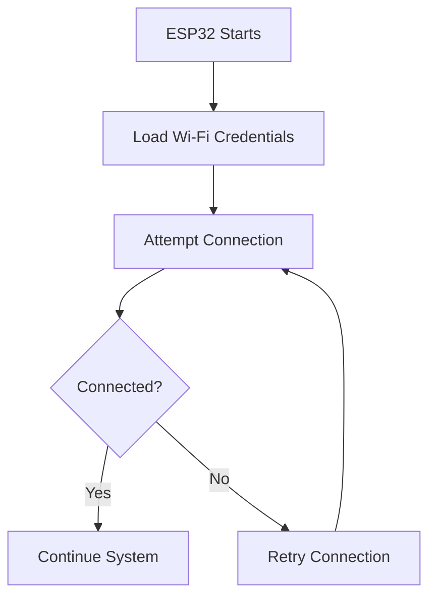

### Expected Result

The Serial Monitor should display something similar to:

```text
Connecting to Wi-Fi...
Wi-Fi Connected
IP Address Assigned
```

---

## Step 05 — Connect and Test the Display

The display is connected to the ESP32.

The first objective is simple:

> Display text successfully.

Example:

```text
HELLO
DESK BUDDY
```

### Initial Display Test

The program should:

1. Initialize the display.
2. Clear the screen.
3. Write text.
4. Refresh the display.

### Expected Result

```text
┌────────────────────┐
│                    │
│    DESK BUDDY      │
│                    │
│    SYSTEM READY    │
│                    │
└────────────────────┘
```

Do not continue until this works reliably.

---

## Step 06 — Get the Current Time

The ESP32 does not automatically know the correct time after every restart.

Therefore, it can synchronize the time through the internet.

The flow is:

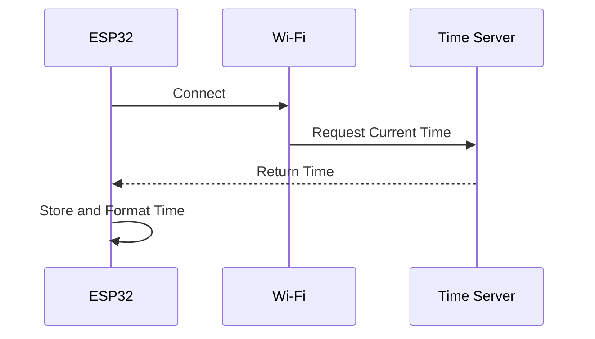

The system should then display:

- Hours
- Minutes
- AM/PM or 24-hour format

Example:

```text
11:42 AM
```

### Expected Result

```text
DESK BUDDY

11:42 AM
```

---

## Step 07 — Display Date

After time synchronization, the program should also extract:

- Day
- Date
- Month
- Year

Example:

```text
Friday
04 September 2026
```

### Expected Result

```text
11:42 AM

Friday
04 September 2026
```

---

## Step 08 — Get Weather Information

The ESP32 will request weather information from an online weather service.

The basic process is:

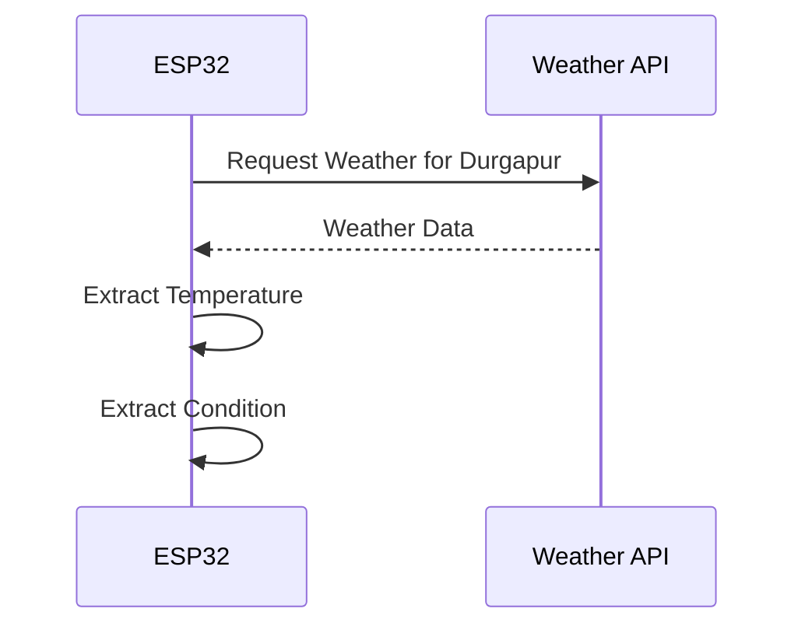

Example data:

```text
Location: Durgapur
Temperature: 30°C
Condition: Cloudy
```

The ESP32 should display only the useful information.

### Important Concept: API

An API is simply a way for one software application to request data from another service.

Example:

```text
ESP32:
"Give me the current weather of Durgapur."

        ↓

Weather Service

        ↓

"30°C, Cloudy"
```

---

## Step 09 — Combine Time, Date and Weather

After all individual features work, combine them into one display.

Example interface:

```text
┌──────────────────────────┐
│       DESK BUDDY         │
│                          │
│        11:42 AM          │
│                          │
│ Friday, 04 September     │
│                          │
│ 📍 Durgapur              │
│ 🌤️ 30°C Cloudy           │
└──────────────────────────┘
```

### Refresh Strategy

Different information should update at different intervals.

| Information | Suggested Update |
|---|---|
| Time | Every second |
| Date | When required |
| Weather | Every 15–30 minutes |

The weather should not be requested every second.

---

## Step 10 — Handle Internet Errors

The system should not completely stop if Wi-Fi disconnects.

Example:

```text
Wi-Fi: Disconnected

Weather:
Unavailable

Time:
11:42 AM
```

The ESP32 should attempt to reconnect.

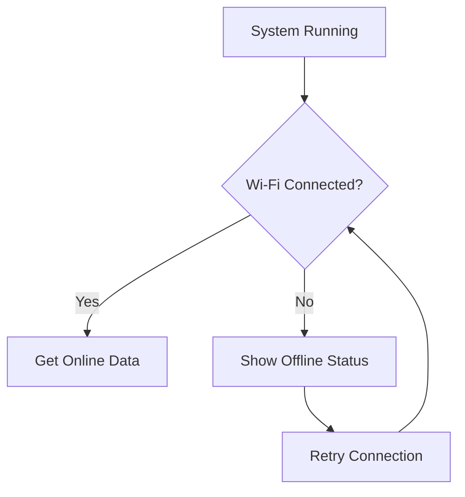

---

## ✅ Phase 01 Completion Checklist

- [ ] ESP32 selected
- [ ] Development environment installed
- [ ] Test code uploaded successfully
- [ ] Serial Monitor working
- [ ] Wi-Fi connection working
- [ ] Display connected
- [ ] Text displayed successfully
- [ ] Current time displayed
- [ ] Date displayed
- [ ] Weather API working
- [ ] Durgapur weather displayed
- [ ] Automatic screen refresh working
- [ ] Basic Wi-Fi error handling added

### Phase 01 Final Result

When power is connected:

```text
POWER ON
    ↓
ESP32 STARTS
    ↓
CONNECTS TO WI-FI
    ↓
GETS TIME
    ↓
GETS WEATHER
    ↓
SHOWS INFORMATION
```

---

# 🟡 Phase 02 — Voice Assistant

## 🎯 Main Goal

Transform the smart display into a basic voice assistant.

The user should be able to ask predefined questions such as:

- "What time is it?"
- "What is today's date?"
- "What is the weather?"
- "What is the temperature?"

The Desk Buddy should answer through the speaker.

---

# Phase 02 System Architecture

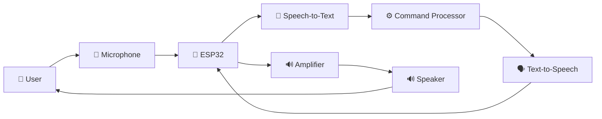

---

## Step 01 — Select and Connect the Microphone

The microphone captures the user's voice.

Basic process:

```text
User Speaks
     ↓
Microphone
     ↓
Audio Signal
     ↓
ESP32
```

The microphone does **not** automatically understand language.

It only captures sound.

### First Test

The first microphone test should verify that audio data is being received.

Expected concept:

```text
🎤 Microphone Connected
Receiving Audio Data...
```

---

## Step 02 — Record Audio

The system must record audio when interaction begins.

Initial activation methods may include:

- Push button
- Touch sensor
- Future wake word

For the first version, a push button is simpler.

Example:

```text
Press Button
      ↓
Start Recording
      ↓
User Speaks
      ↓
Stop Recording
```

---

## Step 03 — Speech-to-Text

Speech-to-Text converts human speech into written text.

Example:

```text
🎤 Audio

"What time is it?"

        ↓

📝 Speech-to-Text

        ↓

"What time is it?"
```

Because full speech recognition can be demanding for a low-cost microcontroller, the system may use an online speech recognition service.

The flow becomes:

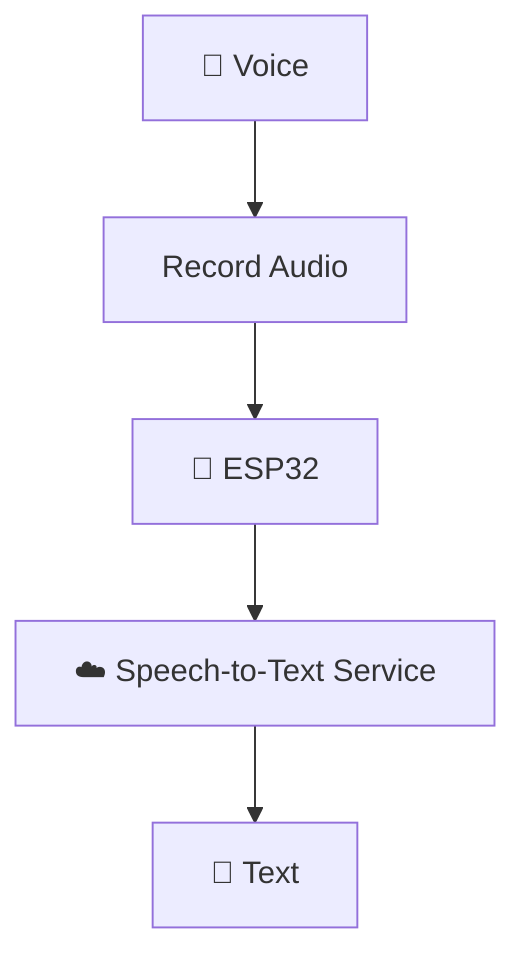

---

## Step 04 — Display the Recognized Text

Before processing commands, verify that Speech-to-Text works.

Example:

```text
You said:

What time is it?
```

This is an important debugging step.

If the text is wrong, the problem may be related to:

- Microphone
- Audio quality
- Internet connection
- Speech recognition service

---

## Step 05 — Create the Command Processor

The command processor checks the recognized text.

Example:

```text
"What time is it?"
        ↓
Check Keywords
        ↓
"time"
        ↓
Get Current Time
```

Basic command logic:

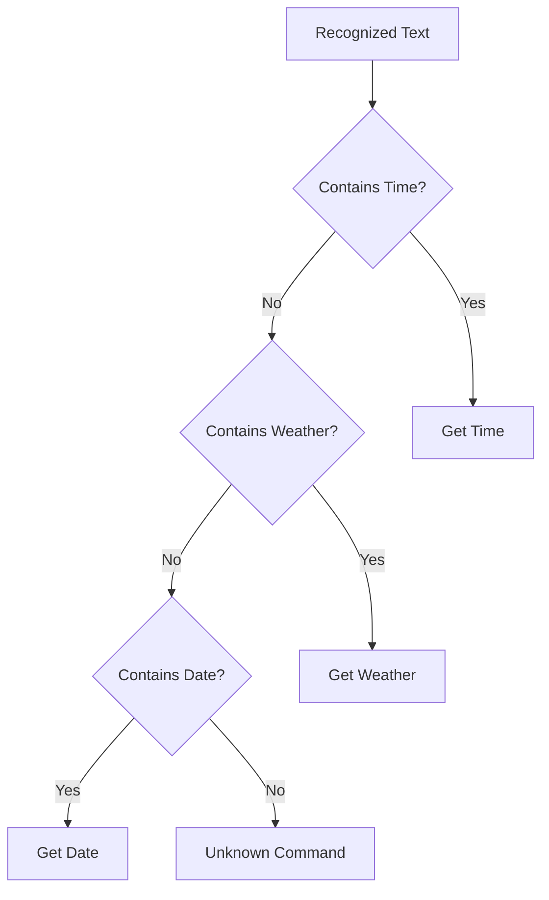

---

## Step 06 — Generate the Response

Once the command is understood, the ESP32 generates a text response.

Example:

```text
Command:
"What time is it?"

        ↓

Response:

"The current time is 11:42 AM."
```

For predefined commands, the response can be generated locally.

No AI is required yet.

---

## Step 07 — Text-to-Speech

Text-to-Speech converts written text into spoken audio.

Example:

```text
"The current time is 11:42 AM."

        ↓

Text-to-Speech

        ↓

Audio Data
```

The initial implementation may use an online Text-to-Speech service.

---

## Step 08 — Connect the Audio Output

The audio must reach the speaker.

The expected hardware flow is:

```text
ESP32
   ↓
Audio Output
   ↓
Audio Amplifier
   ↓
Speaker
```

A suitable amplifier module may be used depending on the selected ESP32 and speaker.

---

## Step 09 — Play the Response

The final Phase 02 flow should work like this:

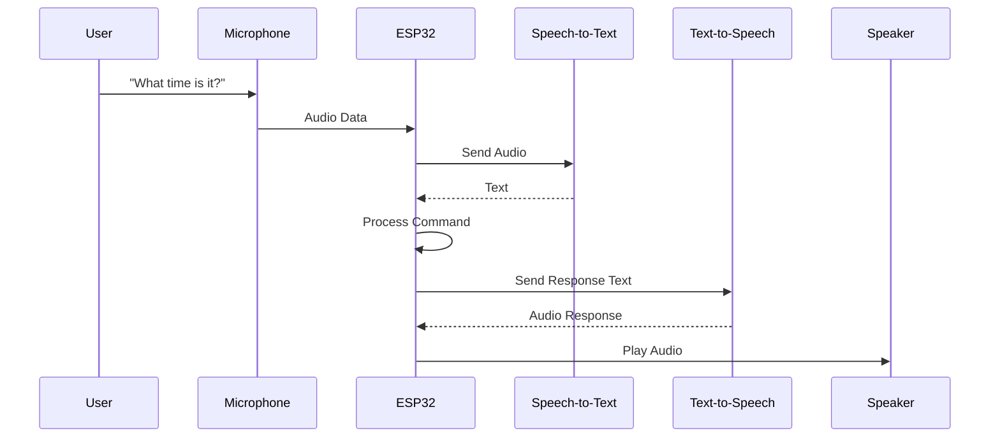

---

## Step 10 — Return to Idle Mode

After answering, the device should return to the normal display.

```text
VOICE INTERACTION
        ↓
PROCESS REQUEST
        ↓
SPEAK RESPONSE
        ↓
RETURN TO IDLE SCREEN
```

---

## ✅ Phase 02 Completion Checklist

- [ ] Microphone selected
- [ ] Microphone connected
- [ ] Audio input tested
- [ ] Voice recording working
- [ ] Speech-to-Text working
- [ ] Recognized text displayed
- [ ] Time command working
- [ ] Date command working
- [ ] Weather command working
- [ ] Text response generated
- [ ] Text-to-Speech working
- [ ] Amplifier connected
- [ ] Speaker working
- [ ] Full voice interaction tested
- [ ] Returns to idle mode

### Phase 02 Final Result

```text
YOU SPEAK
    ↓
MICROPHONE CAPTURES VOICE
    ↓
SPEECH-TO-TEXT
    ↓
COMMAND DETECTED
    ↓
RESPONSE CREATED
    ↓
TEXT-TO-SPEECH
    ↓
SPEAKER ANSWERS
```

---

# 🔴 Phase 03 — AI Assistant

## 🎯 Main Goal

Allow Desk Buddy to answer general questions.

Unlike Phase 02, the system will no longer be limited to fixed commands.

Examples:

- "What is a black hole?"
- "Explain artificial intelligence."
- "Who invented the telephone?"
- "What is machine learning?"
- "Explain recursion."

---

# Why AI is Needed

A command-based system can only understand requests that are programmed.

Example:

```text
"What time is it?"       ✅
"What is the weather?"   ✅
```

But:

```text
"Explain quantum physics"
```

cannot be answered by simple keyword matching.

Therefore, the system sends the question to an AI service.

---

## Phase 03 System Flow

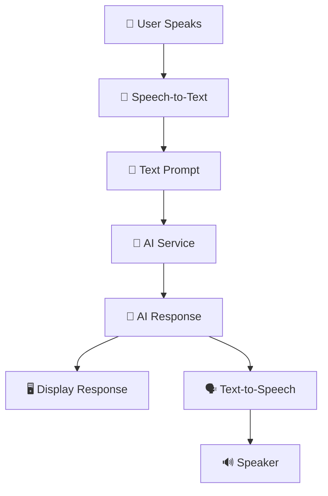

---

## Step 01 — Prepare AI Communication

The ESP32 will send a text request through Wi-Fi.

Example:

```text
User Question:

"What is a black hole?"

        ↓

ESP32

        ↓ Wi-Fi

AI Service
```

The AI service processes the request and sends back text.

---

## Step 02 — Receive AI Response

Example:

```text
Question:
What is a black hole?

        ↓

AI Response:

A black hole is a region of space
with extremely strong gravity.
```

The ESP32 receives the response.

---

## Step 03 — Display the AI Response

The screen may first show:

```text
🤔 Thinking...
```

Then:

```text
A black hole is a
region of space with
extremely strong gravity.
```

Long answers may need to:

- Scroll automatically
- Display page by page
- Be shortened before speaking

---

## Step 04 — Speak the AI Response

The AI response is converted into speech.

```text
AI Response Text
       ↓
Text-to-Speech
       ↓
Audio
       ↓
Speaker
```

---

## Step 05 — Add Local vs AI Decision Logic

Not every request needs AI.

For example:

```text
"What time is it?"
```

The ESP32 already knows how to answer this.

Therefore:

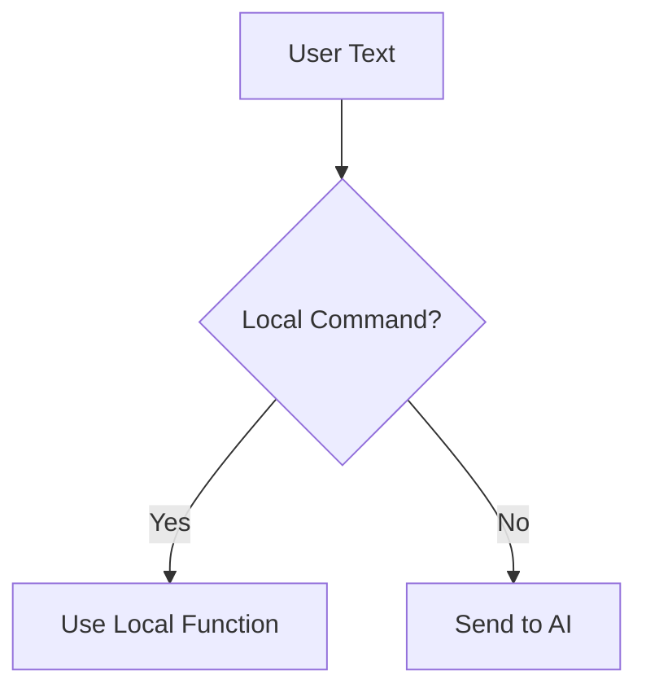

Examples:

| Request | Processing |
|---|---|
| What time is it? | Local |
| What is today's date? | Local |
| What is the weather? | Local/API |
| Explain a black hole | AI |
| Tell me about Python | AI |

This approach can reduce unnecessary AI requests.

---

## Step 06 — Handle AI Errors

The system should handle problems such as:

- No internet
- AI service unavailable
- Invalid request
- Timeout
- Empty response

Example:

```text
⚠️ Unable to contact AI.

Please check the
internet connection.
```

The device should then return to idle mode.

---

## Step 07 — Improve the User Experience

Possible states:

| State | Display |
|---|---|
| Idle | ⏰ Time and Weather |
| Listening | 🎤 Listening... |
| Processing | 🤔 Processing... |
| AI | 🧠 Thinking... |
| Speaking | 🔊 Speaking... |
| Error | ⚠️ Error |

---

## ✅ Phase 03 Completion Checklist

- [ ] AI service selected
- [ ] AI communication tested
- [ ] Text prompt sent successfully
- [ ] AI response received
- [ ] AI response displayed
- [ ] AI response converted to speech
- [ ] Long response handling added
- [ ] Local vs AI routing working
- [ ] Internet error handling added
- [ ] Complete voice-to-AI workflow tested

---

# 🧪 Testing Strategy

Every major feature should be tested independently.

## Hardware Tests

### ESP32

- [ ] Powers on
- [ ] Program uploads
- [ ] Restarts correctly

### Wi-Fi

- [ ] Connects successfully
- [ ] Reconnects after disconnection

### Display

- [ ] Turns on
- [ ] Shows text
- [ ] Refreshes correctly

### Microphone

- [ ] Captures audio
- [ ] Voice quality is acceptable

### Speaker

- [ ] Produces audio
- [ ] Speech is understandable

---

# 🏗️ Final Architecture

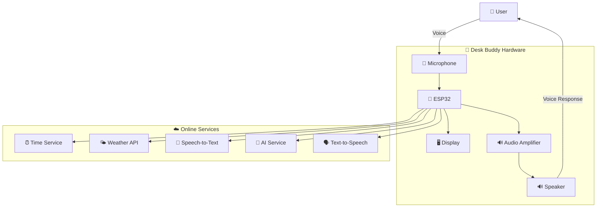

---

# 🏁 Complete Final Flow

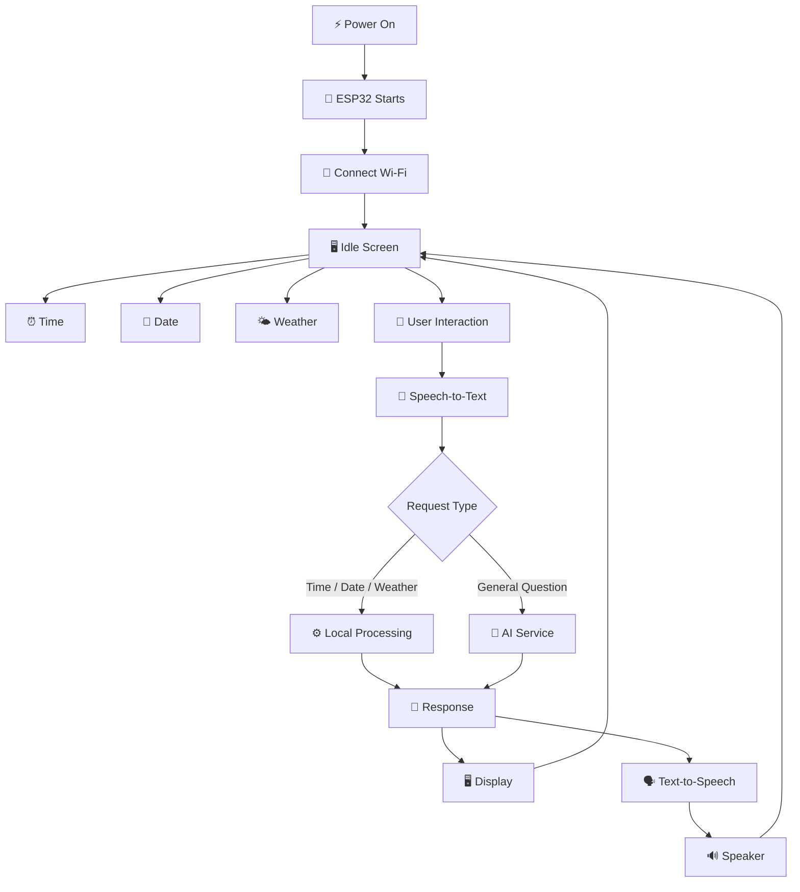

---

# 📌 Important Project Rules

1. **Do not build everything at once.**
2. **Test every component separately.**
3. **Do not purchase unnecessary hardware before testing requirements.**
4. **Keep the ₹2000 budget in mind.**
5. **Start with Phase 01.**
6. **Move to Phase 02 only after Phase 01 works properly.**
7. **Move to Phase 03 only after the voice pipeline works.**

---

# 🎯 Final Goal

The completed Desk Buddy should work like this:

> You turn on the device.

The Desk Buddy automatically:

1. Starts the ESP32.
2. Connects to Wi-Fi.
3. Shows the current time.
4. Shows the date.
5. Shows the weather for Durgapur.

When you interact with it:

1. You speak.
2. The microphone captures your voice.
3. Speech-to-Text converts your voice into text.
4. The system decides whether it is a local command or an AI question.
5. The correct service processes the request.
6. The answer appears on the display.
7. Text-to-Speech converts the answer into audio.
8. The speaker speaks the answer.
9. The device returns to its normal idle display.

---

> **Development Rule:** Build → Test → Confirm → Improve 🤖
