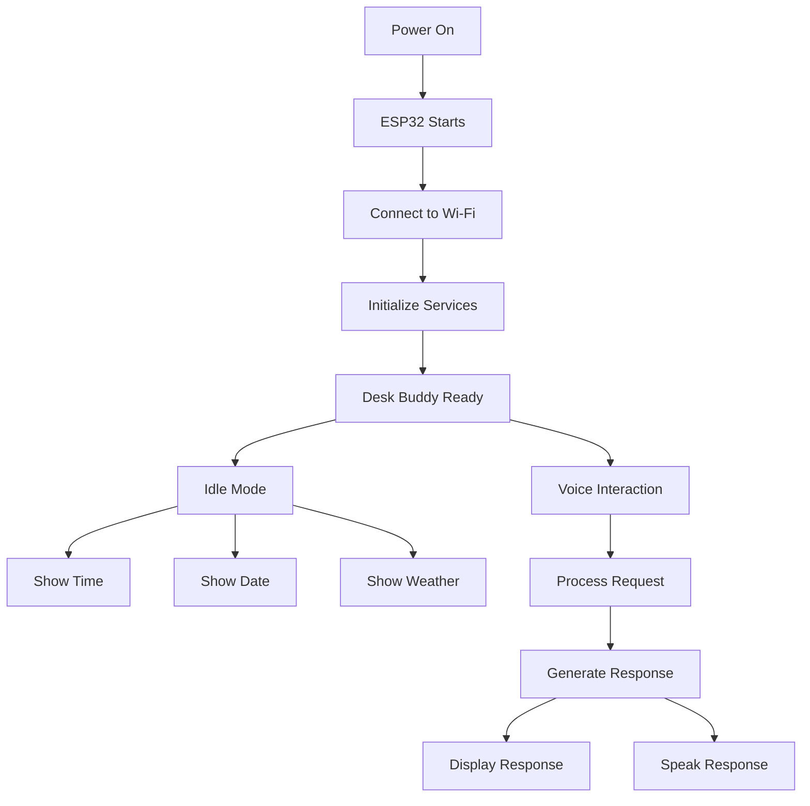

# 🤖 Desk Buddy

> A low-cost, Wi-Fi-enabled smart desk companion designed to display useful information and gradually evolve into an AI-powered voice assistant.

---

## 📌 Table of Contents

- [About the Project](#-about-the-project)
- [Project Vision](#-project-vision)
- [Core Features](#-core-features)
- [Development Phases](#-development-phases)
- [System Architecture](#-system-architecture)
- [How It Works](#-how-it-works)
- [Hardware Overview](#-hardware-overview)
- [Software Stack](#-software-stack)
- [Project Structure](#-project-structure)
- [Internet Dependency](#-internet-dependency)
- [Budget Goal](#-budget-goal)
- [Future Improvements](#-future-improvements)
- [Project Status](#-project-status)

---

# 🤖 About the Project

**Desk Buddy** is a compact smart desk companion built around an ESP32-based microcontroller.

The project starts as a simple smart display capable of showing:

- ⏰ Current time
- 📅 Current date
- 🌤️ Current weather
- 📍 Weather information for a predefined location

The project will gradually evolve into a voice-controlled assistant capable of:

- 🎤 Listening to voice commands
- 📝 Converting speech into text
- 🧠 Understanding user requests
- 🔊 Replying through a speaker
- 🤖 Answering general questions using an AI service
- 🖥️ Displaying responses on a screen

The main goal is to build the project **step by step** while keeping the total hardware cost close to **₹2000**.

---

# 🎯 Project Vision

The long-term goal is to create a small device that can permanently sit on a desk and work independently.

Once the device is programmed and connected to power and Wi-Fi, it should work without requiring a computer to remain turned on.

