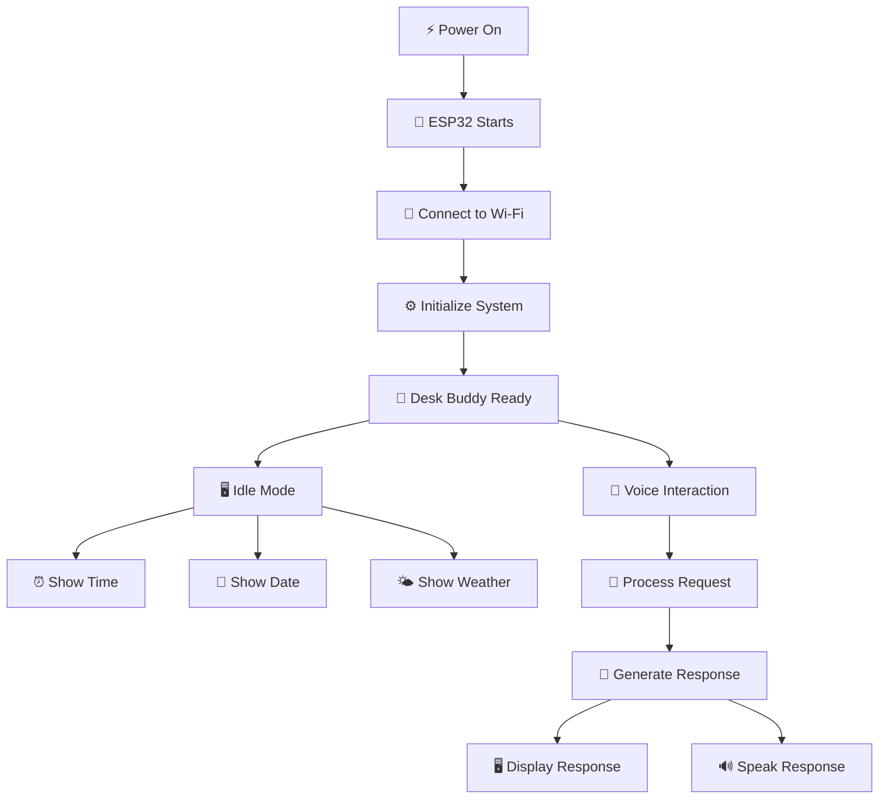
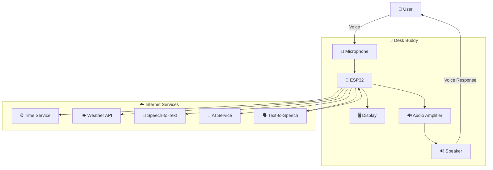
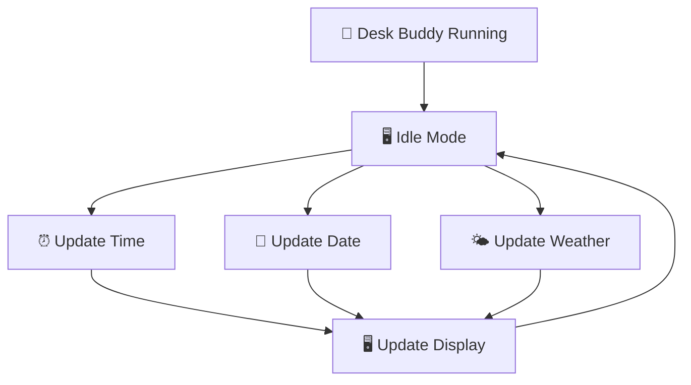
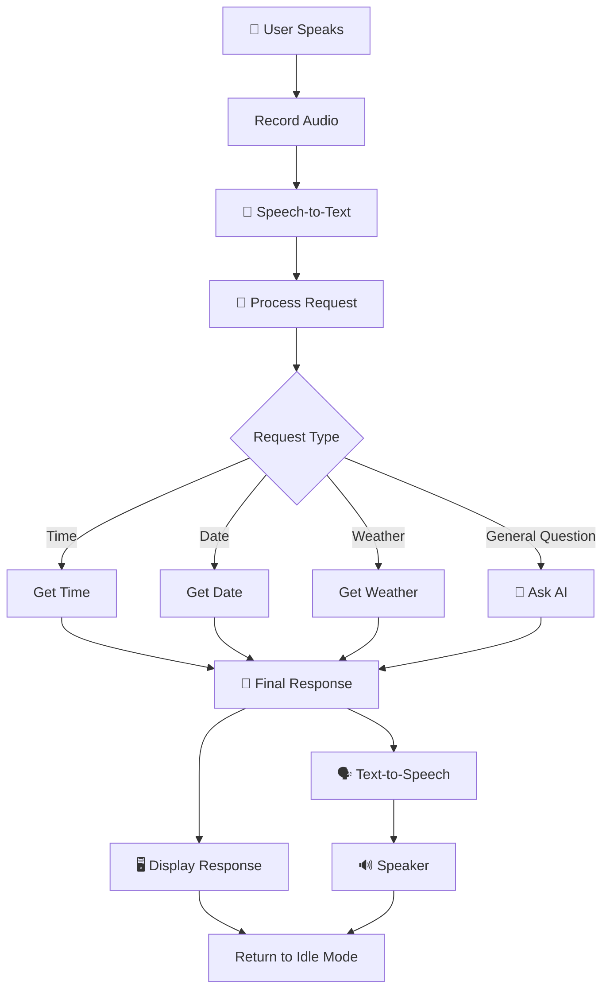
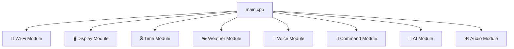
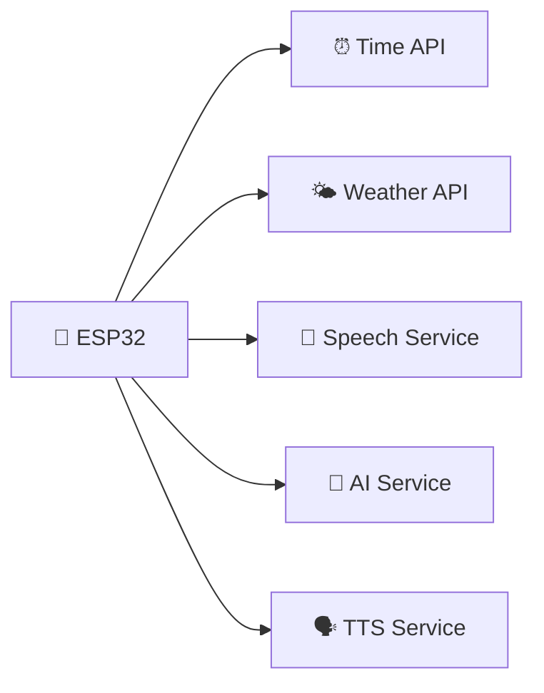
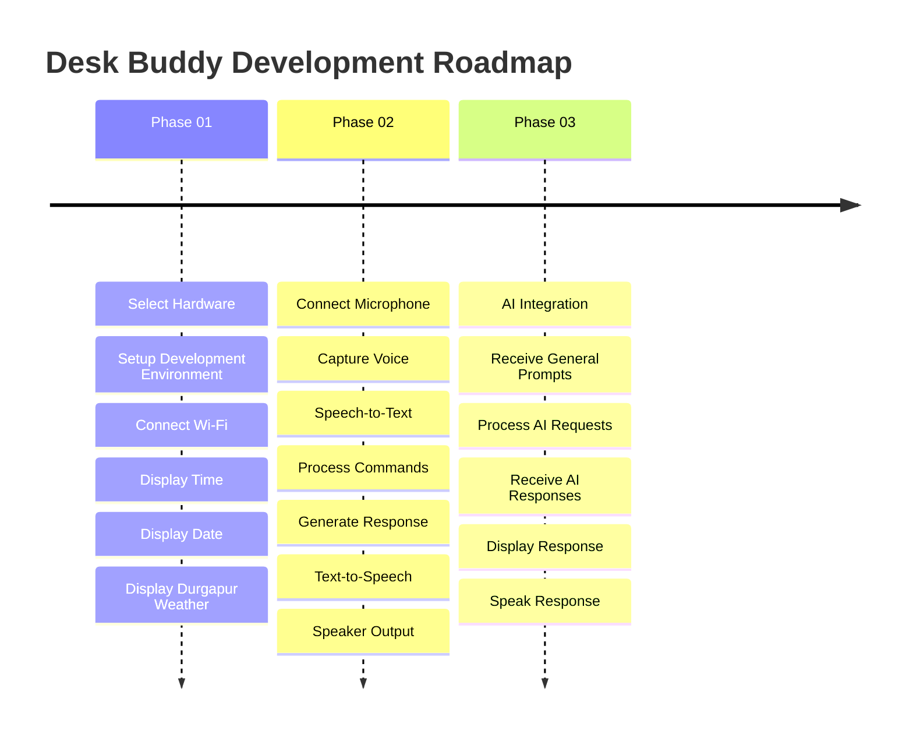
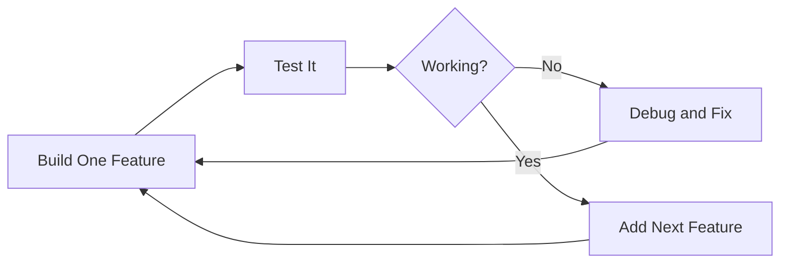
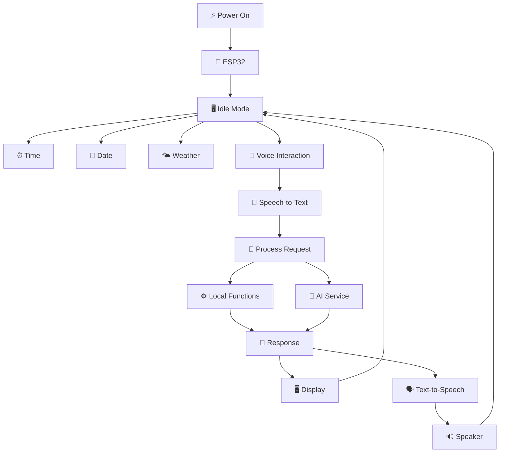

# 🤖 Desk Buddy

> A low-cost smart desk companion built using an ESP32-based microcontroller. Desk Buddy starts as a smart information display and gradually evolves into a voice-controlled AI assistant.


---

## 📖 Table of Contents

- [About the Project](#-about-the-project)
- [Project Vision](#-project-vision)
- [Features](#-features)
- [Development Phases](#-development-phases)
- [System Architecture](#-system-architecture)
- [How Desk Buddy Works](#-how-desk-buddy-works)
- [Hardware Overview](#-hardware-overview)
- [Software Stack](#-software-stack)
- [Programming Architecture](#-programming-architecture)
- [Project Structure](#-project-structure)
- [Internet Dependency](#-internet-dependency)
- [Budget Goal](#-budget-goal)
- [Future Improvements](#-future-improvements)
- [Development Philosophy](#-development-philosophy)
- [Project Status](#-project-status)

---

# 📌 About the Project

**Desk Buddy** is a compact smart desk companion designed to sit permanently on a desk and provide useful information and voice-based interaction.

The project is designed with a **step-by-step development approach**.

Instead of immediately attempting to build a complete AI assistant, the project starts with a simple and reliable system:

- ⏰ Displaying the current time
- 📅 Displaying the current date
- 🌤️ Displaying the current weather
- 📍 Showing weather information for a predefined location

After the basic display system is working correctly, the project will gradually introduce:

- 🎤 Voice input
- 📝 Speech-to-Text
- 🧠 Command processing
- 🔊 Text-to-Speech
- 🤖 AI-powered conversations

The primary goal is to create a working device within an approximate hardware budget of **₹2000**.

---

# 🎯 Project Vision

The final Desk Buddy should work as an independent physical device.

After programming the microcontroller and connecting the device to power:

```text
PC OFF
   │
   ▼
Desk Buddy continues running
```

The computer should **not need to remain switched on** for normal operation.

The device will communicate directly with online services through Wi-Fi when internet access is required.



---

# ✨ Features

## 🕒 Smart Information Display

The Desk Buddy will display useful real-time information.

### Initial features

- Current time
- Current date
- Day of the week
- Current weather
- Temperature
- Weather condition
- Fixed location: **Durgapur**

Example:

```text
┌──────────────────────────┐
│       DESK BUDDY         │
│                          │
│        11:42 AM          │
│                          │
│ Friday, 04 September     │
│                          │
│ 🌤️ DURGAPUR              │
│     30°C                 │
│     Cloudy               │
└──────────────────────────┘
```

---

## 🎤 Voice Input

In later development phases, the Desk Buddy will be able to receive voice commands.

Example:

> **User:** "What time is it?"

The microphone captures the user's voice and sends audio data to the system.

---

## 📝 Speech-to-Text

The recorded voice will be converted into text.

```text
🎤 User Voice
"What time is it?"
        │
        ▼
📝 Text
"What time is it?"
```

---

## 🧠 Command Processing

For predefined requests, the system can determine which function should be executed.

```text
"What time is it?"
        │
        ▼
TIME REQUEST
        │
        ▼
Get Current Time
        │
        ▼
Generate Response
```

Supported commands may include:

- What time is it?
- What is today's date?
- What is the weather?
- What is the temperature?

---

## 🔊 Voice Response

The Desk Buddy will convert text responses into spoken audio.


---

## 🤖 AI Assistant

The final phase will allow the Desk Buddy to answer general questions.

Examples:

- "What is a black hole?"
- "Explain artificial intelligence."
- "Who invented the telephone?"
- "What is 25 multiplied by 16?"

The question will be converted from voice into text and sent to an AI service. The response will then be displayed on the screen and spoken through the speaker.

---

# 🚀 Development Phases

| Phase | Name | Main Objective |
|---|---|---|
| 🟢 Phase 01 | Smart Desk Display | Time, Date and Weather |
| 🟡 Phase 02 | Basic Voice Assistant | Voice commands and spoken replies |
| 🔴 Phase 03 | AI Voice Assistant | General AI conversations |

For a complete step-by-step explanation of every development phase, see:

➡️ **[PHASES.md](PHASES.md)**

---

# 🏗️ System Architecture



---

# ⚙️ How Desk Buddy Works

## 🖥️ Idle Mode

When the user is not interacting with the device, the display will show useful information.



## 🎤 Interaction Mode



---

# 🧩 Hardware Overview

> ⚠️ The exact hardware models have not been finalized yet.

## 🧠 Main Controller

### ESP32 / ESP32-S3

The main controller acts as the brain of the Desk Buddy.

Responsibilities include:

- Connecting to Wi-Fi
- Running the main program
- Controlling the display
- Making API requests
- Receiving microphone data
- Processing commands
- Controlling audio output

The final ESP32 model will be selected based on:

- Price
- RAM
- GPIO availability
- Audio compatibility
- Library support
- Future expandability

## 🖥️ Display

The display will show:

- Time
- Date
- Weather
- System status
- Voice responses
- AI responses

Possible options include:

- OLED Display
- TFT Display

## 🎤 Microphone

The microphone will capture the user's voice.

```text
User Voice
     │
     ▼
🎤 Microphone
     │
     ▼
Digital Audio
     │
     ▼
🧠 ESP32
```

An I2S-based microphone may be used in the final design.

## 🔊 Audio Amplifier

The ESP32 may require an external audio amplifier to drive a speaker.

Possible component:

**MAX98357A**

```text
ESP32
   │
   │ I2S Audio
   ▼
MAX98357A
   │
   ▼
Speaker
```

## 🔊 Speaker

The speaker will provide audio responses.

Possible requirements:

- Small size
- Low power consumption
- Clear speech output

## 🔌 Additional Components

The project may also require:

- Jumper wires
- Breadboard
- USB cable
- Push button
- Power supply

---

# 💻 Software Stack

## Programming Language

The main firmware will primarily be written in:

### C++

## Development Environment

### Arduino IDE

Suitable for:

- Beginners
- Initial testing
- Small experiments
- Hardware testing

### VS Code + PlatformIO

Suitable for:

- Larger projects
- Multiple source files
- Better project organization
- Advanced dependency management

---

# 🧠 Programming Architecture



---

# 📁 Proposed Project Structure

```text
DeskBuddy/
│
├── README.md
├── PHASES.md
│
├── src/
│   ├── main.cpp
│   ├── wifi.cpp
│   ├── display.cpp
│   ├── time_manager.cpp
│   ├── weather.cpp
│   ├── voice.cpp
│   ├── command_processor.cpp
│   ├── ai.cpp
│   └── audio.cpp
│
├── include/
│   ├── config.h
│   ├── wifi.h
│   ├── display.h
│   ├── time_manager.h
│   ├── weather.h
│   ├── voice.h
│   ├── command_processor.h
│   ├── ai.h
│   └── audio.h
│
├── lib/
│
└── platformio.ini
```

> The final structure may change depending on whether Arduino IDE or PlatformIO is used.

---

# 🌐 Internet Dependency

| Feature | Internet Required |
|---|---|
| Display stored information | ❌ No |
| Current time synchronization | ✅ Initially |
| Internal clock after synchronization | ❌ Temporarily |
| Live weather | ✅ Yes |
| Speech-to-Text | Likely ✅ |
| AI responses | ✅ Yes |
| Cloud Text-to-Speech | Likely ✅ |

The device should handle temporary internet failures gracefully.

---

# 💾 Where Does the Program Run?

The source code is written on a computer.

```text
💻 Computer
     │
     ▼
Write C++ Code
     │
     ▼
Compile Program
     │
     ▼
Upload Firmware
     │
     ▼
🧠 ESP32 Flash Memory
```

After uploading the firmware:

```text
Power ON
   │
   ▼
ESP32 Boots
   │
   ▼
Loads Program
   │
   ▼
Desk Buddy Starts
```

The PC does **not** need to remain powered on.

---

# ☁️ Does Desk Buddy Need a Server?

For the initial version, **a personal server is not necessarily required**.

The device can directly communicate with online APIs.



A backend server may become useful later for:

- API key protection
- User settings
- Conversation history
- Custom processing
- Additional automation

---

# 💰 Budget Goal

## Target Budget

# ₹2000

The project will be planned carefully to avoid unnecessary purchases.

The hardware selection should consider both:

1. **Current requirements**
2. **Future expansion**

---

# 🛣️ Development Roadmap



---

# 🔮 Future Improvements

Possible future improvements include:

## 🗣️ Wake Word Detection

Example:

> "Hey Buddy"

The Desk Buddy detects the wake phrase before listening to a command.

## 😊 Animated Face

The screen could display different expressions.

| State | Expression |
|---|---|
| Idle | 👀 |
| Listening | 👂 |
| Thinking | 🤔 |
| Speaking | 😊 |
| Error | 😕 |

## 🔔 Alerts and Reminders

- Study reminders
- Alarm
- Task reminders
- Important notifications

## 📅 Calendar Integration

Example:

> "What is my schedule today?"

## 🌡️ Sensors

- Temperature sensor
- Humidity sensor
- Light sensor

---

# 🧪 Development Philosophy

> ## Build → Test → Confirm → Improve

The project should **not** attempt to connect all hardware and features at once.



---

# 📊 Project Status

| Feature | Status |
|---|---|
| Project Concept | ✅ Complete |
| Phase Planning | ✅ Complete |
| README Documentation | ✅ Complete |
| Hardware Selection | ⏳ Pending |
| Phase 01 | ⏳ Not Started |
| Phase 02 | ⏳ Not Started |
| Phase 03 | ⏳ Not Started |

---

# 🏁 Final Goal



## 🤖 Final Capabilities

The completed Desk Buddy should be capable of:

- 🕒 Showing the current time
- 📅 Showing the current date
- 🌤️ Showing live weather
- 📍 Providing weather information for Durgapur
- 🎤 Receiving voice input
- 📝 Converting speech into text
- 🧠 Processing predefined commands
- 🤖 Answering general questions through AI
- 🖥️ Displaying responses
- 🔊 Speaking responses

---

# 📚 Detailed Development Guide

For the complete implementation plan, development steps, testing strategy, and phase-by-phase checklist:

➡️ **[Read PHASES.md](PHASES.md)**

---

> **Current Project Status:** 🟡 Planning & Hardware Selection
>
> **Development Rule:** One feature at a time. Build it, test it, confirm it, then move forward. 🤖
